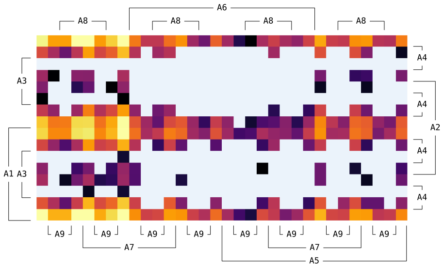
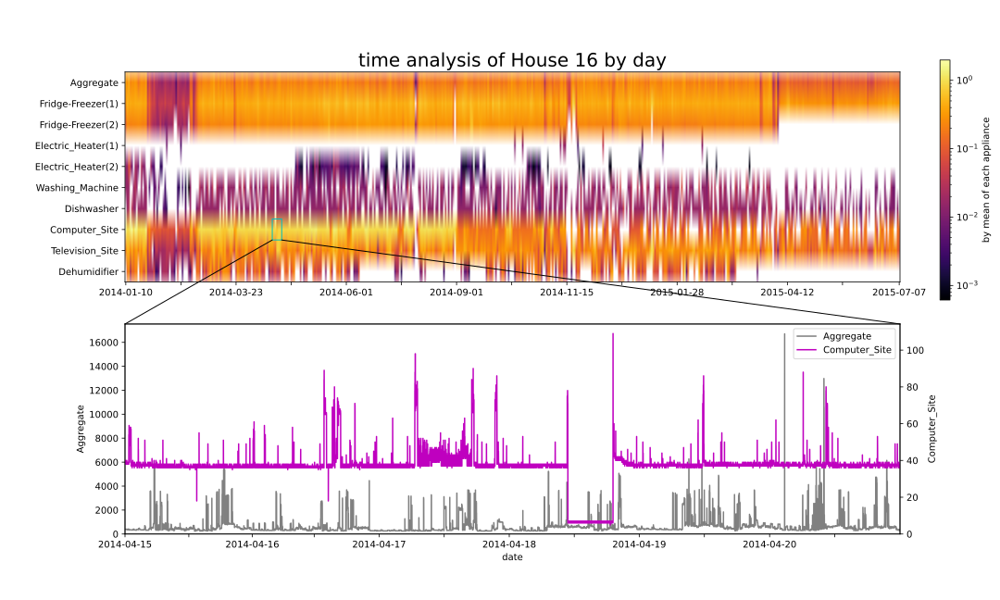

# the Pseudo Karnaugh Map

## Introduction

The Pseudo Karnaugh Map (PKMap),
a coloured Weighted / Multi-valued Karnaugh Map,
an Enchanced Karnaugh Map as the project's initially named,
is an evaluation method to visualize the imbalanced class distribution
of a dataset.

This project was started to guide the generating of synthesis datasets
in which a self-collected data is added into a public dataset.
Later, we found it works in dataset imbalance representation as well.

The codes is programmed and tested on Python 3.8
both on Windows 10 version 2004 and Mojave 10.14.6.
Since a new format feature introduced in [PEP498](https://www.python.org/dev/peps/pep-0498/)
is used, Python lower than 3.6 (inclusive) need a few extra adapting.

## Why PKMap?

Gain instructive insight of a datset before utilizing
is currently virtually impossible.
The PKMap is expected to offer an intuitionistic and visualized recognization
of the imbalanced classes distribution of a dataset.

## Installation

The `pypi` support is coming.
A directly clone is always welcomed.

## How to use

First, you'll need to import a dataset (usually a .csv file)
using `read_REFIT()`.
We'll use REFIT (can be downloaded [here](https://pureportal.strath.ac.uk/en/datasets/refit-electrical-load-measurements-cleaned))
as a demonstration from a relative path.

```python
from pkmap import pkmap

file_path = './REFIT/CLEAN_House16.csv'
obj = pkmap(file_path)
```

The `.PTb`, a pseudo truth table, is a dictionary of statistic result which looks like this:

```python
obj.PTb = {
    # ......
    '11100010': 53,
    '11100110': 627,
    # ......
},
```

The `.keys()` represents the ON/OFF state of each 9 appliances.
And the `.values()` means how many times the state combination
is counted.
Details about this has been explained in my latest paper
(reference will be updated soon)

A Karnaugh map caj be displayed by:

```python
obj.plot()
```



The colormap we used for default is `inferno`,
where the brigner means more, and the darker mean less.
Those pretty light blue means the relative combination is missing.

In case you want to change the colormap, you can do:

```python
obj.plot(data, cmap='viridis')
```

Or, you can save the PKMap by offering a fig type
(the suffix of the file name):

```python
obj.plot(data, fig_types='.png')
```

As the figure type will be passed to `matplotlib.pyplot.savefig`,
formats will not be supported except

```python
eps, jpeg, jpg, pdf, pgf, png, ps, raw, rgba, svg, svgz, tif, tiff
```

## previewing

A preview funtion on the whole 9 appilances of a single dataset
in REFIT has been accomplished bascilly.

Here is an example how to use it:

```python
p1 = pkmap('./REFIT/CLEAN_House16.csv', count=False)
p1.preview()
```



The upper axis plots each appliance's data (including aggregate data)
in hours. The data are devided by mean of each applilance for
better color experience.
The lower axis plots the data slice in original data according to
where the user point out on the upper axis.
And the clicked part is hightlighted by a cyan rectangle for conspicuousness.

Besides, this preview tool can also help in evaluation assessment,
and represent where the moedel behavior better or worse and
the releative waves.

## Publications

A primiary paper has been accepted by a conference.
More will be submitted on [arXiv](https://www.arxiv.org) in the future.
