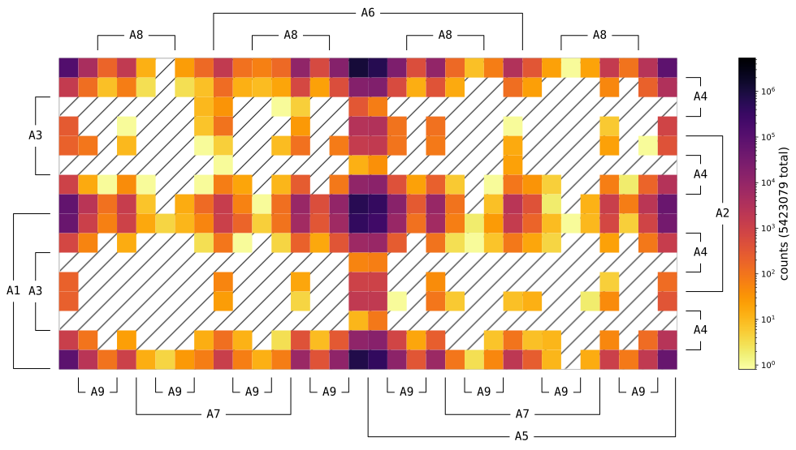

## How to use

First, you'll need to import a dataset (usually a .csv file)
using `read_REFIT()`.
We'll use REFIT (can be downloaded [here](https://pureportal.strath.ac.uk/en/datasets/refit-electrical-load-measurements-cleaned))
as a demonstration from a relative path.

```python
from pkmap import PKMap

file_path = './REFIT/CLEAN_House17.csv'
obj = PKMap(file_path)
```

In update [bd9401a](https://github.com/PKMap/PKMap/commit/bd9401abe7d50ca91637d8a25bf43aaa0a1fce25),
we add support for `nilmtk.Buildings` item:

```python
from nilmtk import DataSet
from pkmap import PKMap

D1 = DataSet('refit.h5')
obj = PKMap(file=D1.Buildings[16])
```

(Ignore the part below if it doesn't make sense)

The `.PTb`, a pseudo truth table, is a dictionary of statistic result which looks like this:

```python
obj.PTb = {
    # ......
    '11100010': 53,
    '11100110': 627,
    # ......
},
```

The `.keys()` represents the ON/OFF state of each 9 appliances.
And the `.values()` means how many times the state combination
is counted.
Details about this has been explained in my latest paper
(reference will be updated soon)

A Karnaugh map can be displayed by:

```python
obj.plot()
```



BTW, the background with `patch=r'/'` is successfully added
in update [ddab932](https://github.com/PKMap/PKMap/commit/ddab9322d1139f090f1a1d4ccd5276a4acd15b58)
under the help of `Artist.set_zorder()`.

The colormap we used for default is `inferno_r`,
where the brigner means less, and the darker mean more.
This makes the 'lighter' parts looks like the background color.

In case you want to change the colormap, you can do:

```python
obj.plot(data, cmap='viridis_r')
```

Or, you can save the PKMap by offering a fig type
(str without dot or any Iterable item is supported):

```python
obj.plot(data, fig_types='png')
```

As the figure type will be passed to `matplotlib.pyplot.savefig`,
formats will not be supported except

```python
(eps, jpeg, jpg, pdf, pgf, png, ps, raw, rgba, svg, svgz, tif, tiff)
```

Also, a default value of `("png", "svg")` will be used
if `fig_types` is set to `"d"` or `"default"`.
