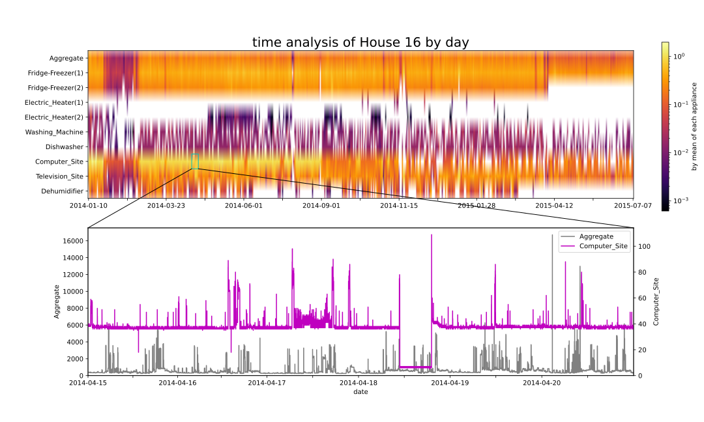

# previewing

A preview funtion on the whole 9 appilances of a single dataset
in REFIT has been accomplished bascilly.

==**This feature is currently unstable**==

Here is an example how to use it:

```python
p1 = PKMap('./REFIT/CLEAN_House16.csv', count=False)
p1.preview()
```



The upper axis plots each appliance's data (including aggregate data)
in hours. The data are devided by mean of each applilance for
better color experience.
The lower axis plots the data slice in original data according to
where the user point out on the upper axis.
And the clicked part is hightlighted by a cyan rectangle for conspicuousness.

Besides, this preview tool can also help in evaluation assessment,
and represent where the moedel behavior better or worse and
the releative waves.
